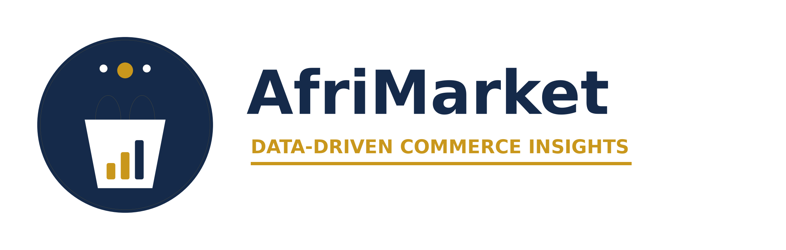

<p align="center">
  
</p>

<h1 align="center">Analyse Stratégique de la Performance E-commerce</h1>
<p align="center"><em>Audit · Data Cleaning · Feature Engineering · Analyses business · Simulation financière · Dashboard</em></p>

---

## 🗺️ Contexte

AfriMarket est une entreprise e-commerce panafricaine (Électronique, Mode, Beauté, Maison) active
dans 8 villes d'Afrique francophone. Ce projet répond à une commande de la direction : analyser 6
mois de données commerciales pour comprendre les variations de chiffre d'affaires, le taux de
retour, l'efficacité marketing et les écarts de performance entre villes — et transformer ces
constats en décisions chiffrées.

## 📦 Contenu du dépôt

```
Projet_AfriMarket/
├── data/
│   ├── afrimarket_dataset_senior.csv   # dataset brut (source)
│   └── df_clean.csv                    # dataset nettoyé + features (généré par le notebook)
├── notebooks/
│   └── Analyse_AfriMarket.ipynb        # notebook complet : audit → cleaning → features → analyses → simulation
├── dashboard/
│   └── app.py                          # dashboard Streamlit interactif
├── reports/
│   ├── Resume_Executif_AfriMarket.docx/.pdf        # synthèse business, 5 pages
│   ├── Rapport_Analyse_Complet_AfriMarket.docx/.pdf # rapport complet, 18 pages, avec annexes
│   └── Presentation_AfriMarket_Direction.pptx       # PowerPoint pour le comité de direction
├── figures/                            # graphiques exportés par le notebook
├── assets/brand/                       # identité visuelle (logo, favicon)
├── .streamlit/config.toml              # thème du dashboard (Navy/Or)
├── requirements.txt                    # dépendances de PRODUCTION (dashboard uniquement)
└── requirements-dev.txt                # dépendances complètes (notebook, rapport, PPTX)
```

## 🚀 Lancer le projet en local

```bash
python -m venv .venv
.venv\Scripts\activate          # Windows
pip install -r requirements-dev.txt

# Notebook
jupyter notebook notebooks/Analyse_AfriMarket.ipynb

# Dashboard
streamlit run dashboard/app.py
```

## ☁️ Déployer le dashboard sur Streamlit Community Cloud

1. Pousser ce dépôt sur GitHub (public ou privé).
2. Sur [share.streamlit.io](https://share.streamlit.io), créer une nouvelle app en pointant vers
   `dashboard/app.py` comme fichier principal.
3. Streamlit Cloud installe automatiquement les dépendances depuis **`requirements.txt`** (à la
   racine du dépôt) — volontairement minimal (`streamlit`, `pandas`, `numpy`, `plotly`) pour un
   déploiement rapide. `requirements-dev.txt` n'est utile qu'en local.
4. Le thème (`.streamlit/config.toml`) et le logo (`assets/brand/`) sont versionnés avec le code :
   aucune configuration supplémentaire n'est nécessaire côté cloud.

## 🔍 Principal constat d'audit

La colonne `categorie` contenait un label générique `"electronique"` (minuscule, sans accent) qui
ne correspondait **pas** à une simple variante orthographique d'`"Électronique"` : il recouvrait en
réalité des produits des 4 catégories réelles (confirmé par le préfixe du nom de produit). La
catégorie a donc été reconstruite à partir de `nom_produit`, une source plus fiable — un piège
qu'une simple normalisation de texte (`.str.title()`) n'aurait pas détecté.

## 📊 Chiffres clés (après nettoyage — 9 400 commandes sur 10 100)

| Indicateur | Valeur |
|---|---|
| Chiffre d'affaires total | 2 385 987 € |
| Profit net estimé | 380 448 € |
| Panier moyen | 258,87 € |
| Taux d'annulation | 1,9 % |
| Taux de retour | 8,1 % |
| Impact combiné estimé des 3 actions correctives (simulation financière) | +39 702 € (+10,4 % de profit net) |

## 📖 Dictionnaire de données (résumé)

| Variable construite | Formule |
|---|---|
| `chiffre_affaires` | `prix_unitaire × quantite × (1 − remise)`, 0 si commande Annulée |
| `marge_brute` | `chiffre_affaires × taux_marge` (taux estimé par catégorie) |
| `profit_net` | `marge_brute − cout_livraison − cout_marketing` |
| `indicateur_retour` | 1 si `statut_commande = Retournée` |
| `nombre_commandes_par_client` | fréquence d'achat du client |
| `valeur_vie_client` | somme du CA généré par le client (CLV simplifiée) |

Le dictionnaire complet (colonnes sources + variables construites) est disponible en Annexe A du
rapport complet (`reports/Rapport_Analyse_Complet_AfriMarket.pdf`).

## ⚠️ Limites & hypothèses

- Le coût d'achat réel des produits n'étant pas fourni, la marge brute repose sur des taux de
  marge estimés par catégorie (documentés dans le notebook et les rapports).
- La simulation financière applique des hypothèses prudentes et linéaires ; elle donne un ordre
  de grandeur actionnable, pas une prévision garantie.
- L'échantillon couvre 6 mois : les tendances saisonnières au-delà ne sont pas extrapolées.

## 🎨 Identité visuelle

Le logo (`assets/brand/`) associe un panier marchand (e-commerce), des barres de croissance
(data-driven) et un point réseau reliant deux nœuds (marketplace panafricaine connectée), dans
une palette Navy/Or cohérente sur l'ensemble des livrables (notebook, dashboard, rapports, PPTX).
