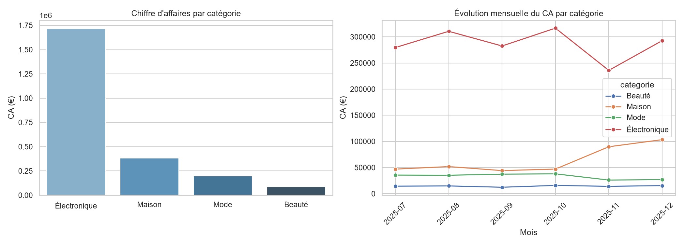
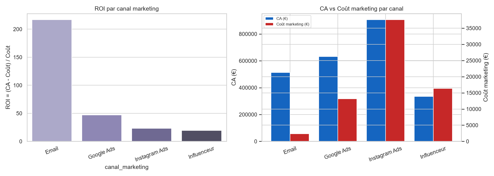

<p align="center">
  
</p>

<h1 align="center">Analyse Stratégique de la Performance E-commerce</h1>
<p align="center"><em>Audit de données · Data Cleaning · Feature Engineering · Analyses business · Simulation financière · Dashboard interactif</em></p>

<p align="center">
  
  
  
  
</p>

---

## Sommaire

1. [Contexte & problématique business](#1-contexte--problématique-business)
2. [Livrables du projet](#2-livrables-du-projet)
3. [Arborescence du dépôt](#3-arborescence-du-dépôt)
4. [Méthodologie](#4-méthodologie)
5. [Résultats clés](#5-résultats-clés)
6. [Simulation financière — impact chiffré](#6-simulation-financière--impact-chiffré)
7. [Recommandations stratégiques & feuille de route](#7-recommandations-stratégiques--feuille-de-route)
8. [Dictionnaire de données](#8-dictionnaire-de-données)
9. [Stack technique](#9-stack-technique)
10. [Installation & lancement en local](#10-installation--lancement-en-local)
11. [Déploiement du dashboard (Streamlit Cloud)](#11-déploiement-du-dashboard-streamlit-cloud)
12. [Limites & hypothèses](#12-limites--hypothèses)
13. [Identité visuelle](#13-identité-visuelle)
14. [Auteur & licence](#14-auteur--licence)

---

## 1. Contexte & problématique business

**AfriMarket** est une entreprise e-commerce panafricaine active dans **8 villes** d'Afrique
francophone (Kinshasa, Abidjan, Douala, Dakar, Lomé, Cotonou, Libreville, Brazzaville), sur
**4 catégories** de produits : Électronique, Mode, Beauté, Maison.

La direction a constaté :
- des **variations importantes du chiffre d'affaires** selon les mois et les villes ;
- un **taux de retour préoccupant** sur certains produits ;
- des **dépenses marketing élevées**, sans visibilité claire sur leur rentabilité par canal ;
- des **différences de performance** marquées selon les villes, non expliquées.

Ce projet, mené dans le rôle de Data Analyst, part de 6 mois de données commerciales brutes
(`afrimarket_dataset_senior.csv`, 10 100 commandes) volontairement imparfaites — incohérences,
doublons, erreurs de saisie, valeurs aberrantes — pour produire une analyse de bout en bout :
audit → nettoyage → construction d'indicateurs métier → analyses business → simulation financière
→ recommandations priorisées, restituées sous plusieurs formats adaptés à des audiences
différentes (notebook technique, rapport complet, résumé exécutif, présentation direction,
dashboard interactif).

## 2. Livrables du projet

| Livrable | Fichier | Audience | Description |
|---|---|---|---|
| **Notebook d'analyse** | [`notebooks/Analyse_AfriMarket.ipynb`](notebooks/Analyse_AfriMarket.ipynb) | Data / Tech | Reproductible de bout en bout : audit → cleaning → feature engineering → 5 analyses → simulation financière. Commenté, exécuté sans erreur. |
| **Rapport d'analyse complet** | [`reports/Rapport_Analyse_Complet_AfriMarket.pdf`](reports/Rapport_Analyse_Complet_AfriMarket.pdf) | Management / Référence | 18 pages : méthodologie détaillée, toutes les analyses, simulation financière, recommandations, feuille de route, annexes (dictionnaire de données, limites). Sommaire cliquable. |
| **Résumé exécutif** | [`reports/Resume_Executif_AfriMarket.pdf`](reports/Resume_Executif_AfriMarket.pdf) | Comité de direction | 5 pages maximum : KPIs, constats clés par axe, 5 recommandations, conclusion. Lecture en moins de 5 minutes. |
| **Présentation PowerPoint** | [`reports/Presentation_AfriMarket_Direction.pptx`](reports/Presentation_AfriMarket_Direction.pptx) | Comité de direction | 15 slides, identité visuelle Navy/Or, incluant une matrice impact/effort et une feuille de route 30/60/90 jours. |
| **Dashboard interactif** | [`dashboard/app.py`](dashboard/app.py) | Tous | Application Streamlit filtrable (ville, catégorie, canal, statut, période) avec 4 onglets d'analyse et KPIs en temps réel. |
| **Dataset nettoyé** | [`data/df_clean.csv`](data/df_clean.csv) | Data | Données auditées, nettoyées et enrichies de 9 variables métier, prêtes à l'emploi. |

## 3. Arborescence du dépôt

```
Projet_AfriMarket/
├── data/
│   ├── afrimarket_dataset_senior.csv    # dataset brut (source, 10 100 lignes)
│   └── df_clean.csv                     # dataset nettoyé + features (9 400 lignes, généré par le notebook)
├── notebooks/
│   └── Analyse_AfriMarket.ipynb         # notebook complet : audit → cleaning → features → analyses → simulation
├── dashboard/
│   └── app.py                           # dashboard Streamlit interactif
├── reports/
│   ├── Resume_Executif_AfriMarket.docx / .pdf         # synthèse business, 5 pages
│   ├── Rapport_Analyse_Complet_AfriMarket.docx / .pdf # rapport complet, 18 pages, avec annexes
│   └── Presentation_AfriMarket_Direction.pptx         # PowerPoint pour le comité de direction
├── figures/                              # graphiques exportés par le notebook (PNG haute résolution)
├── assets/brand/                         # identité visuelle (logo plein, icône, favicon, versions clair/sombre)
├── .streamlit/config.toml                # thème du dashboard (Navy/Or)
├── requirements.txt                      # dépendances de PRODUCTION (dashboard uniquement)
├── requirements-dev.txt                  # dépendances complètes (notebook, rapports, PPTX)
├── .gitignore
└── README.md                             # ce document
```

## 4. Méthodologie

### 4.1 Source et volumétrie

Fichier source : 10 100 commandes enregistrées du 1er juillet au 31 décembre 2025, sur 14 variables
(identifiants, attributs produit, commande, logistique, marketing). Voir le
[dictionnaire de données](#8-dictionnaire-de-données) complet.

### 4.2 Audit de la qualité des données

| Problème détecté | Description | Volume concerné |
|---|---|---|
| Doublons | Commandes strictement dupliquées (même `id_commande`) | 100 lignes (1,0 %) |
| Ville mal orthographiée | `"Kinshassa"` au lieu de `"Kinshasa"` | 605 lignes (6,0 %) |
| **Catégorie corrompue** | Label générique `"electronique"` recouvrant en réalité les **4** vraies catégories | 606 lignes (6,0 %) |
| Prix négatifs | `prix_unitaire` enregistré avec un signe négatif (erreur de saisie) | 632 lignes (6,3 %) |
| Remises négatives | `remise` enregistrée avec un signe négatif | 614 lignes (6,1 %) |
| Quantités nulles | `quantite = 0` : commande sans article, aucune vente réelle | 608 lignes (6,0 %) |
| Statuts non uniformes | Casse incohérente : `"retournée"` vs `"Livrée"` vs `"Annulée"` | Toutes les lignes |
| Valeurs manquantes | Aucune valeur nulle détectée | 0 |

> **Zoom — le piège de la catégorie « electronique »** : une analyse croisée entre `categorie` et
> le préfixe de `nom_produit` révèle que ce label ne recouvre pas seulement des produits
> électroniques (137 Beauté, 127 Maison, 175 Mode, 167 Électronique mal étiquetés). C'est une
> erreur de saisie systémique, pas un problème de casse — qu'une simple normalisation de texte
> (`.str.title()`) aurait laissé passer. La catégorie a donc été **reconstruite depuis
> `nom_produit`**, source plus fiable.

### 4.3 Stratégie de nettoyage (`df_clean`)

| # | Action | Justification |
|---|---|---|
| 1 | Suppression des doublons (`id_commande`) | Éviter le double comptage du CA et des KPIs |
| 2 | Conversion des dates en `datetime` | Permettre les agrégations mensuelles |
| 3 | Correction `"Kinshassa"` → `"Kinshasa"` | Uniformiser l'analyse géographique |
| 4 | Reconstruction de `categorie` depuis `nom_produit` | La colonne source est corrompue pour ~6 % des lignes |
| 5 | Valeur absolue sur `remise` et `prix_unitaire` | Erreurs de signe confirmées ; distributions cohérentes par catégorie après correction |
| 6 | Suppression des commandes `quantite = 0` | Aucun chiffre d'affaires possible, aucun sens métier |
| 7 | Uniformisation de la casse de `statut_commande` | Fiabiliser les comptages par statut |

**Résultat : 9 400 commandes conservées sur 10 100 (93,1 %)**, sans perte d'information
commerciale réelle (les lignes écartées ne représentaient aucune vente valide).

### 4.4 Feature engineering

AfriMarket ne fournissant pas le coût d'achat des produits, la marge brute est **estimée** via un
taux de marge moyen par catégorie (Électronique 15 %, Mode 45 %, Beauté 50 %, Maison 30 %),
cohérent avec les standards du secteur. Détail complet dans la
[section dictionnaire de données](#8-dictionnaire-de-données).

## 5. Résultats clés

### Performance globale

| Indicateur | Valeur |
|---|---|
| Chiffre d'affaires total | **2 385 987 €** |
| Profit net estimé | **380 448 €** (≈16 % du CA) |
| Panier moyen | 258,87 € |
| Taux d'annulation | 1,9 % |
| Taux de retour | 8,1 % |

### Par catégorie — *quelle catégorie prioriser ?*



| Catégorie | CA | % du CA | Marge brute | Profit net | Taux de retour |
|---|---|---|---|---|---|
| **Électronique** | 1 717 556 € | 72,0 % | 257 633 € | 223 421 € | **15,3 %** |
| Maison | 382 914 € | 16,0 % | 114 874 € | 89 488 € | 4,9 % |
| Mode | 198 864 € | 8,3 % | 89 489 € | 49 569 € | 7,3 % |
| Beauté | 86 653 € | 3,6 % | 43 327 € | 17 971 € | 2,8 % |

→ L'Électronique porte 72 % du CA mais un taux de retour presque double des autres catégories :
c'est à la fois la priorité d'investissement et la priorité d'optimisation qualité.

### Géographique — *où investir davantage ?*

| Ville | CA | Profit | Taux d'annulation |
|---|---|---|---|
| Kinshasa | 715 718 € | 113 736 € | 0,3 % |
| Abidjan | 475 957 € | 75 486 € | 0,0 % |
| Dakar | 327 923 € | 53 382 € | 0,0 % |
| **Douala** | 319 058 € | 50 036 € | **12,9 %** ⚠️ |
| Lomé | 176 076 € | 28 311 € | 0,0 % |
| Cotonou | 151 258 € | 24 665 € | 0,0 % |
| Libreville | 117 693 € | 18 543 € | 0,0 % |
| Brazzaville | 102 304 € | 16 288 € | 0,0 % |

→ Kinshasa + Abidjan = 50 % du CA et du profit (marchés à consolider). Douala affiche une anomalie
d'annulation à corriger avant tout renforcement marketing.

### Marketing — *quel canal mérite plus de budget ?*



| Canal | CA | Coût marketing | ROI = (CA−Coût)/Coût |
|---|---|---|---|
| **Email** | 512 087 € | 2 349 € | **217,0** |
| Google Ads | 632 289 € | 13 159 € | 47,1 |
| Instagram Ads | 906 637 € | 37 637 € | 23,1 |
| Influenceur | 334 974 € | 16 360 € | **19,5** ⚠️ |

→ L'Email est massivement sous-exploité (ROI 217 pour un coût quasi nul). L'Influenceur, le moins
efficace, doit être recadré ou réduit.

### Clients — *comment améliorer la rétention ?*

| Indicateur | Valeur |
|---|---|
| Clients actifs | 1 747 |
| % de clients récurrents (>1 commande) | 74,0 % |
| Concentration Pareto | **31,5 % des clients génèrent 80 % du CA** |

Segmentation simple (fréquence × valeur) : **Champions** (à sécuriser en priorité), **Gros
acheteurs occasionnels** (à relancer), **Fidèles à faible panier** (cross-sell), **À risque /
occasionnels** (réactivation ciblée).

## 6. Simulation financière — impact chiffré

Différenciateur de ce projet : au-delà des constats descriptifs, l'impact business de 3 actions
correctives est **chiffré** avec des hypothèses prudentes et explicites (détail dans le notebook,
section 6, et le rapport complet, section 8) :

| Action | Hypothèse de calcul | Gain estimé |
|---|---|---|
| Réduire le retour Électronique (15,3 % → 10 %) | Commandes évitées × marge brute moyenne d'une commande livrée | **+ 14 015 €** |
| Corriger l'anomalie d'annulation à Douala | Annulations en excès × panier moyen × taux de marge moyen | **+ 16 299 €** |
| Optimiser l'efficacité coût du canal Influenceur (aligné sur Google Ads, à CA constant) | Écart de coût par euro de CA généré, sans hypothèse de CA supplémentaire | **+ 9 388 €** |
| **IMPACT COMBINÉ ESTIMÉ** | | **+ 39 702 € (+10,4 % de profit net)** |

Ce chiffrage est volontairement conservateur : il n'intègre ni gain de volume ni amélioration de
la fidélisation, qui viendraient s'y ajouter.

## 7. Recommandations stratégiques & feuille de route

1. **Réduire le taux de retour Électronique** — audit qualité fournisseur, fiches produit enrichies. *Impact élevé · Effort moyen · 60 jours*
2. **Corriger l'anomalie opérationnelle de Douala** — investiguer paiement/livraison avant tout budget marketing. *Impact moyen · Effort faible · 30 jours*
3. **Réallouer le budget marketing** — renforcer Email et Google Ads, recadrer l'Influenceur. *Impact élevé · Effort faible · 30 jours*
4. **Lancer un programme de fidélisation « Champions »** — traitement VIP pour le noyau à 80 % du CA. *Impact élevé · Effort moyen · 90 jours*
5. **Industrialiser la qualité de saisie des commandes** — contrôles de validation à la source. *Impact moyen · Effort moyen · 90 jours*

**Feuille de route** : 30 jours (quick wins : Douala, ciblage Influenceur, lancement audit
Électronique) → 60 jours (plan d'action fournisseur, réallocation budgétaire) → 90 jours
(programme de fidélisation, contrôles de saisie).

## 8. Dictionnaire de données

### Colonnes sources (fichier brut)

| Colonne | Description |
|---|---|
| `id_commande` | Identifiant unique de la commande |
| `date_commande` | Date de passation de la commande |
| `id_client` | Identifiant unique du client |
| `ville` | Ville de livraison |
| `categorie` | Catégorie produit déclarée (non fiable avant nettoyage, cf. §4.2) |
| `nom_produit` | Nom du produit commandé |
| `prix_unitaire` | Prix unitaire du produit (€) |
| `quantite` | Quantité commandée |
| `remise` | Taux de remise appliqué (0 à 1) |
| `cout_livraison` | Coût logistique de la commande (€) |
| `methode_paiement` | Moyen de paiement utilisé |
| `canal_marketing` | Canal d'acquisition ayant généré la commande |
| `cout_marketing` | Coût marketing attribué à la commande (€) |
| `statut_commande` | Livrée / Retournée / Annulée |

### Variables construites (`df_clean`)

| Variable | Formule |
|---|---|
| `montant_brut` | `prix_unitaire × quantite` |
| `chiffre_affaires` | `montant_brut × (1 − remise)`, 0 si `statut_commande = Annulée` |
| `taux_marge` | Taux de marge estimé selon la catégorie (Électronique 15 %, Mode 45 %, Beauté 50 %, Maison 30 %) |
| `marge_brute` | `chiffre_affaires × taux_marge` |
| `profit_net` | `marge_brute − cout_livraison − cout_marketing` |
| `mois` | Période `AAAA-MM` extraite de `date_commande` |
| `indicateur_retour` | 1 si `statut_commande = Retournée`, sinon 0 |
| `nombre_commandes_par_client` | Nombre de commandes du client sur la période (fréquence d'achat) |
| `valeur_vie_client` | Somme du `chiffre_affaires` du client sur la période (CLV simplifiée, historique et non projetée) |

## 9. Stack technique

| Usage | Outils |
|---|---|
| Analyse & manipulation de données | Python 3.13, pandas, numpy |
| Visualisation | Matplotlib, Seaborn, Plotly |
| Dashboard interactif | Streamlit |
| Notebook | Jupyter (nbformat / nbconvert / ipykernel) |
| Rapports Word / PDF | python-docx, Microsoft Word (export & TOC) |
| Présentation PowerPoint | python-pptx |
| Identité visuelle | Matplotlib (génération vectorielle du logo) |

## 10. Installation & lancement en local

```bash
python -m venv .venv
.venv\Scripts\activate          # Windows  (source .venv/bin/activate sur macOS/Linux)
pip install -r requirements-dev.txt

# Notebook (audit, cleaning, analyses, simulation)
jupyter notebook notebooks/Analyse_AfriMarket.ipynb

# Dashboard interactif
streamlit run dashboard/app.py
```

## 11. Déploiement du dashboard (Streamlit Cloud)

1. Pousser ce dépôt sur GitHub (public ou privé).
2. Sur [share.streamlit.io](https://share.streamlit.io), créer une nouvelle app en pointant vers
   `dashboard/app.py` comme fichier principal.
3. Streamlit Cloud installe automatiquement les dépendances depuis **`requirements.txt`** (à la
   racine du dépôt) — volontairement minimal (`streamlit`, `pandas`, `numpy`, `plotly`) pour un
   déploiement rapide et fiable. `requirements-dev.txt` n'est utile qu'en local.
4. Le thème (`.streamlit/config.toml`) et le logo (`assets/brand/`) sont versionnés avec le code :
   aucune configuration supplémentaire n'est nécessaire côté cloud.

## 12. Limites & hypothèses

- Le coût d'achat réel des produits n'étant pas fourni, la marge brute repose sur des taux de
  marge **estimés** par catégorie (documentés en §4.4 et §8).
- La simulation financière (§6) applique des hypothèses linéaires prudentes ; elle donne un ordre
  de grandeur actionnable, pas une prévision garantie.
- La CLV utilisée est une valeur **historique simplifiée** (somme du CA observé), non une valeur
  projetée sur la durée de vie future du client.
- L'échantillon couvre 6 mois : les tendances saisonnières au-delà de cette période ne sont pas
  extrapolées avec certitude.

## 13. Identité visuelle


Le logo associe un **panier marchand** (e-commerce), des **barres de croissance** (data-driven
decision making) et un **point réseau reliant deux nœuds** (marketplace panafricaine connectée),
dans une palette **Navy (#152A4A) / Or (#C9971C)** cohérente sur l'ensemble des livrables
(notebook, dashboard, rapports, PowerPoint). Déclinaisons disponibles dans
[`assets/brand/`](assets/brand/) : logo complet (fond clair / fond sombre), icône seule, favicon.

## 14. Auteur & licence

Projet réalisé dans le cadre d'un exercice d'analyse de données (Data Analyst) sur un jeu de
données fictif. Document et code à usage démonstratif / académique — libre de réutilisation à des
fins d'apprentissage, avec mention de la source.
